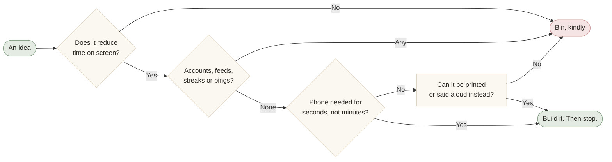

<p align="center">
  
</p>

<p align="center">
  
  
  
  
  
  
</p>

<p align="center">
  <a href="https://mohitagw15856.github.io/present/"><strong>Try it</strong></a> ·
  <a href="#the-eleven">The tools</a> ·
  <a href="#a-quick-tour">Tour</a> ·
  <a href="#run-it-locally">Run it</a> ·
  <a href="#deploy-it">Deploy it</a> ·
  <a href="#add-a-question-a-card-or-a-quiz-line">Contribute</a>
</p>

# Present

**Small web tools for putting the phone down.** No accounts, no tracking, no feeds, no streaks, and absolutely nothing that buzzes.

> Working title. The three we like better: **Tableside** (where the phone goes), **Eyes Up** (what the tools ask of you), **Hearth** (the thing we gather around). Got a fourth? Open an issue. We will discuss it in person if at all possible.

---

## The problem, in one paragraph

You are at dinner. Someone tells a story. Halfway through, three people glance at a screen. Nobody remembers the ending. Multiply by every dinner. That is the problem. Most apps that promise to fix it want you to open them more often, which is a bit like a diet plan delivered as a cake.

## The fix, in one rule

**Every tool here must reduce time on screen.** Not "be useful". Not "be delightful". Reduce it. If using a tool means looking at a phone longer than not using it, the tool gets deleted, however clever it is. This has already killed some good ideas and we are at peace with that.

Here is the whole review process for a new idea:



Everything else follows from that rule:

- 🔒 **No accounts, no backend, no analytics, no cookies.** It is a folder of static files. There is nothing to log in to and nowhere for your data to go.
- 🙅 **No feeds, no notifications, no streaks.** The three mechanics that turn a tool into a habit. We use none of them.
- ⏱️ **Seconds, not minutes.** If a tool needs a phone at all, it needs it briefly, then face down.
- 🖨️ **Paper beats pixels.** Where something can be printed or said out loud, it is.
- ✈️ **Works offline** once loaded, thanks to a small service worker. Your own device is the only place anything is remembered, in plain `localStorage` you can clear whenever you like.

The long version is in [`docs/principles.md`](docs/principles.md). Read it before proposing a tool. It is short and slightly stern.

<details>
<summary><strong>Things we said no to</strong> (a small graveyard)</summary>
<br>

| Idea | Why it died |
|------|-------------|
| A leaderboard for Table Pact | Turns dinner into a game you play on your phone. The forfeit is the whole scoreboard. |
| "Streak" of consecutive daily questions | A streak is a leash. Miss one and you feel bad; keep one and you check the app to protect it. |
| Sharing your One Question to social media | Puts the phone in your hand for a minute, and puts a feed in front of you on the way. |
| Push notification when Analog Hour starts | The calendar already does this, once, and it is your calendar. We are not going to buzz you about not buzzing you. |
| Cloud sync for the Presence Ledger | Needs an account. The Markdown export is the sync. |
| A trivia bank for Table Quiz | Facts need fact-checking and invite people to look things up. Questions about the people present need neither. |

</details>

## The eleven

| # | Tool | What happens | Phone time | Folder |
|---|------|--------------|-----------|--------|
| 1 | ⏳ **Table Pact** | One big timer for the whole table. Scan to join. Pick up your phone and it notices. The loser gets a forfeit. | ~20 seconds to start | [`tools/table-pact`](tools/table-pact) |
| 2 | 💬 **One Question** | One conversation prompt a day, the same for everyone on Earth. Big type. Read it aloud. You get three "another"s and then it politely refuses. | ~10 seconds | [`tools/one-question`](tools/one-question) |
| 3 | 🎲 **Conversation Roulette** | Pick a depth (light, real, deep). Tap. Answer out loud. Tap. Remembers nothing about you, on purpose. | a tap per question | [`tools/conversation-roulette`](tools/conversation-roulette) |
| 4 | 🪧 **Phone Parking Signs** | Printable "phones rest here" signs and fold-in-half table cards. Six templates from café to grandparents' house. PDF, drawn on your device. | ~1 minute, once | [`tools/phone-parking`](tools/phone-parking) |
| 5 | 🃏 **Noticing Cards** | A 60-card deck of attention prompts. "Find the oldest object in this room." Add your own, print with cut lines, get scissors. | ~1 minute, once | [`tools/noticing-cards`](tools/noticing-cards) |
| 6 | 🚶 **Walk & Talk** | Name your walking partner, pick a duration, get one prompt. Then the screen goes dark. One buzz at halfway. | ~15 seconds, then pocket | [`tools/walk-and-talk`](tools/walk-and-talk) |
| 7 | 📓 **Presence Ledger** | A journal with exactly three fields: who, what, one thing you noticed. A monthly count. Markdown export. No feed, ever. | ~30 seconds per entry | [`tools/presence-ledger`](tools/presence-ledger) |
| 8 | 📅 **Analog Hour** | Commit to one offline hour a week. Get a calendar file and a card that says "I'm offline Sundays 4 to 5pm". | ~30 seconds, once | [`tools/analog-hour`](tools/analog-hour) |
| 9 | 🍺 **Table Quiz** | A pub quiz where every answer is someone at the table. "Who here has broken a bone?" One phone reads, everyone writes, then the reveal and the stories. | the quizmaster's, briefly | [`tools/table-quiz`](tools/table-quiz) |
| 10 | 🫁 **Slow Browser** | A browser extension (Chrome and Firefox) that puts a ten-second breath in front of the infinite scroll. "Is there someone you could talk to instead?" | ten seconds fewer than before | [`tools/slow-browser`](tools/slow-browser) |
| 11 | 🩶 **Grey Mode Toolkit** | Not code. A guide to greyscale, scheduled focus and a hidden app grid on iOS, Android and macOS, with scripts where scripts help. | less, forever | [`tools/grey-mode`](tools/grey-mode) |

The landing page and the philosophy page live in [`site/`](site). Design tokens, layout and the tool registry live in [`packages/shared/`](packages/shared).

## A quick tour

Recorded on a phone-sized viewport in dark mode, which we call candlelight and which is not a terminal.

<table>
  <tr>
    <td align="center"><br><sub><strong>Landing</strong> · manifesto, then cards</sub></td>
    <td align="center"><br><sub><strong>Table Pact</strong> · start, scan, slip, forfeit</sub></td>
    <td align="center"><br><sub><strong>One Question</strong> · three "another"s, then no</sub></td>
  </tr>
  <tr>
    <td align="center"><br><sub><strong>Walk &amp; Talk</strong> · prompt, dark, one line</sub></td>
    <td align="center"><br><sub><strong>Table Quiz</strong> · ask, pens down, reveal</sub></td>
    <td align="center">
      <br><br>
      <sub>The others are for paper:<br>
      <a href="tools/phone-parking">signs</a>, <a href="tools/noticing-cards">cards</a>,<br>
      <a href="tools/analog-hour">a calendar file</a>, <a href="tools/presence-ledger">a Markdown export</a>.<br><br>
      That is rather the point.</sub>
    </td>
  </tr>
</table>

<details>
<summary><strong>How does Table Pact sync without a server?</strong></summary>
<br>

It mostly doesn't, and that is fine. The room *is* the URL: it carries a short code, the start time and the duration, so every phone that scans the QR code shows the same countdown from its own clock. Each phone scores itself and keeps that score in its own `localStorage`, which is exactly the thing that survives a tab being backgrounded (also known as "picking up your phone"). Tabs on the same device also find each other through `BroadcastChannel`. Across devices, the pact is on the honour system, and the page says so. If someone's phone says they kept it and the table disagrees, the table is right.

</details>

<details>
<summary><strong>How does One Question show everyone the same prompt?</strong></summary>
<br>

A tiny hash of today's date picks the index. Press "another" and it hashes the date plus a step number, so a table pressing it together stays together. Three steps a day, counted in `localStorage`, reset at midnight. No server needed to agree on what day it is.

</details>

## Looks

Scandinavian and calm. Muted sage, dusty pink and pale blue on warm cream. One typeface (Inter). Lots of air. Nothing flashes or bounces. Dark mode is candlelight, not a terminal. Every button is big enough to hit with a phone held at arm's length, because that is how far away we hope it stays.

The animations in this README are the most excitement you will get from this project. The site itself has one breathing circle and otherwise sits very still.

## Run it locally

You need Node 20+ and [pnpm](https://pnpm.io).

```sh
pnpm install
pnpm dev          # http://localhost:4321
pnpm build        # static site in site/dist, service worker included
pnpm preview      # serve what you just built
```

The browser extension is its own thing:

```sh
pnpm build:extension     # tools/slow-browser/dist/{chrome,firefox}
```

Then load `dist/chrome` unpacked at `chrome://extensions`, or `dist/firefox/manifest.json` as a temporary add-on at `about:debugging`. Details in [the extension's README](tools/slow-browser/README.md).

## Deploy it

**GitHub Pages, automatically.** Push to `main` and [the workflow](.github/workflows/deploy.yml) builds and deploys. In the repository settings, set Pages → Source to "GitHub Actions" once. The site builds with `BASE_PATH=/<repo-name>/`; for a custom domain, set repository variables `BASE_PATH` to `/` and `SITE_URL` to your domain.

**GitHub Pages, one command.**

```sh
pnpm deploy:github
```

**Cloudflare Pages, one command.**

```sh
pnpm deploy:cloudflare     # after `wrangler login`, once
```

Or connect the repo in the Cloudflare dashboard: build command `pnpm build`, output directory `site/dist`.

## Add a question, a card, or a quiz line

The easiest and best way to contribute. Three plain JSON files at the repo root:

- [`data/questions.json`](data/questions.json), 150 conversation prompts with a `depth` of `light`, `real` or `deep`. Used by One Question, Conversation Roulette and Walk & Talk.
- [`data/noticing-cards.json`](data/noticing-cards.json), 60 attention prompts with `text` and an optional `hint`.
- [`data/table-quiz.json`](data/table-quiz.json), 80 "who at this table…" questions.

House style: original wording, short enough to read aloud, answerable by a child, a grandparent and a stranger at the same table. Open a pull request. Full guidance, including how to propose a whole new tool, in [`CONTRIBUTING.md`](CONTRIBUTING.md).

## What is where

```
present/
├── site/               landing page, philosophy page, service-worker integration
├── packages/shared/    design tokens (tokens.css), Layout.astro, tool registry
├── tools/<name>/       one folder per tool; web tools are Astro integrations that inject a route
├── data/               question bank, card deck, quiz questions
├── docs/               principles.md, and the GIFs and SVGs you just scrolled past
└── .github/workflows/  build and deploy to GitHub Pages
```

Astro 5, Tailwind 4, vanilla JS, pnpm workspaces. No React, because nothing here needed it. The badges above are hand-drawn SVGs in `docs/assets/`, because even the README does not phone home.

## Licence

[MIT](LICENSE). Take it, fork it, print it, put it on a fridge.

<p align="center">
  
</p>
